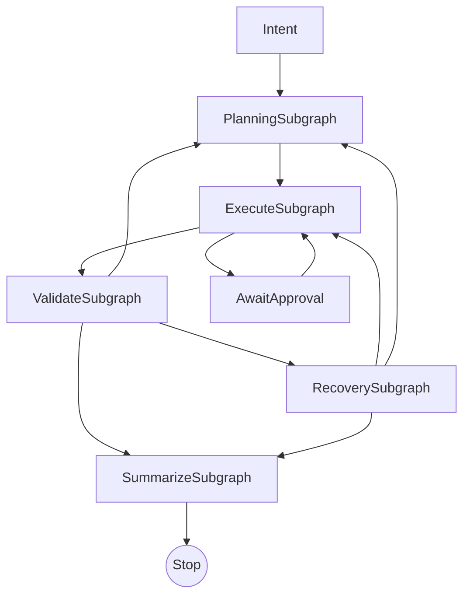
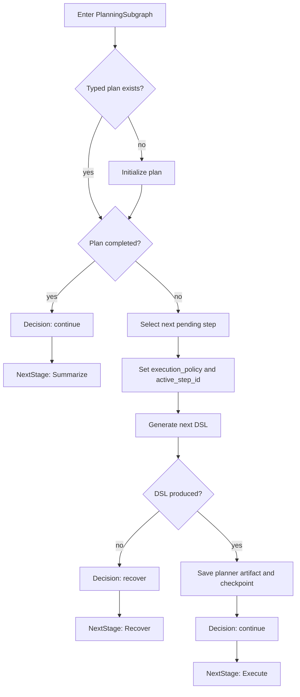
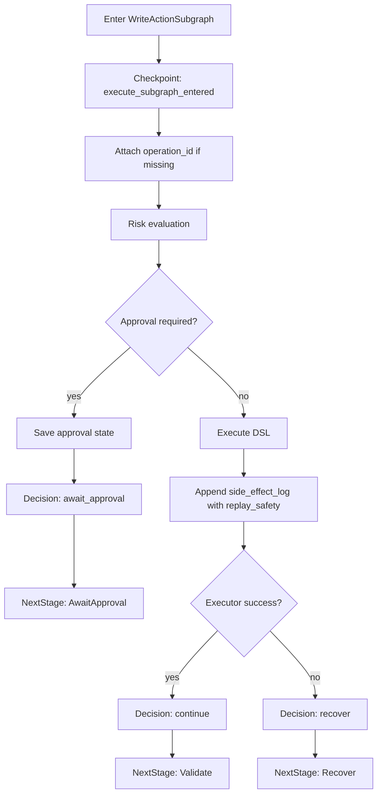
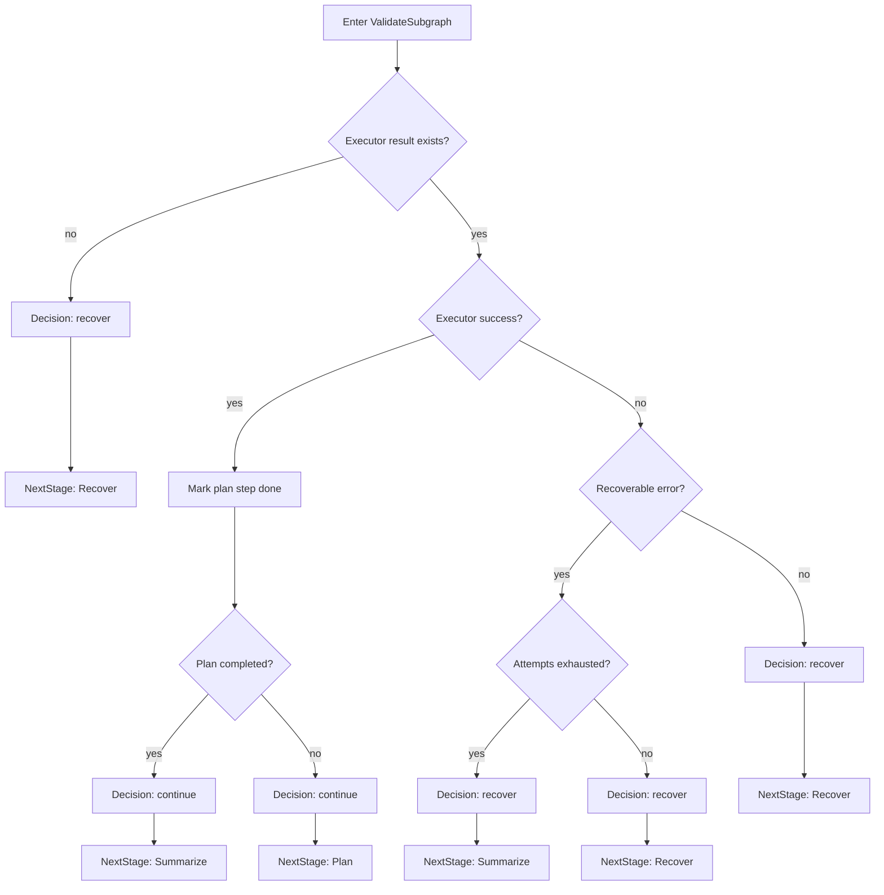
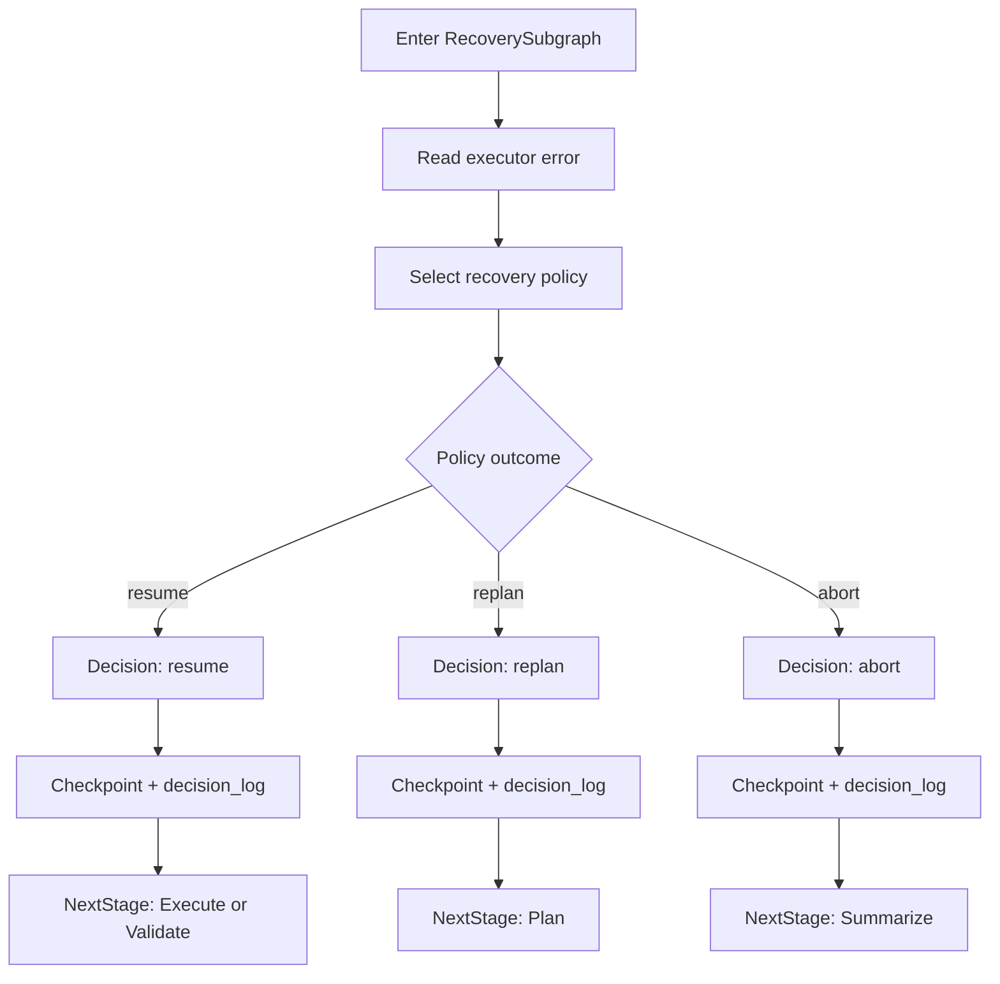
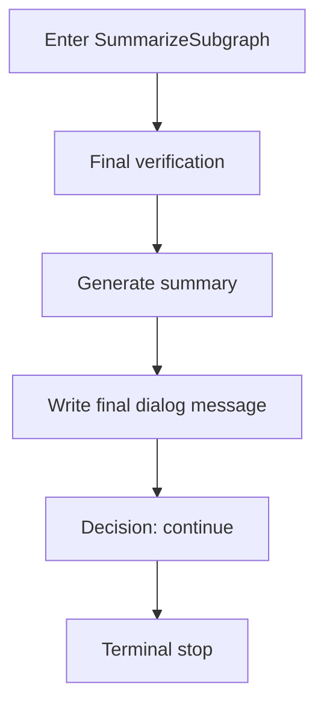
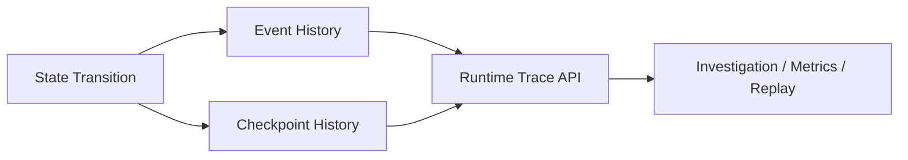
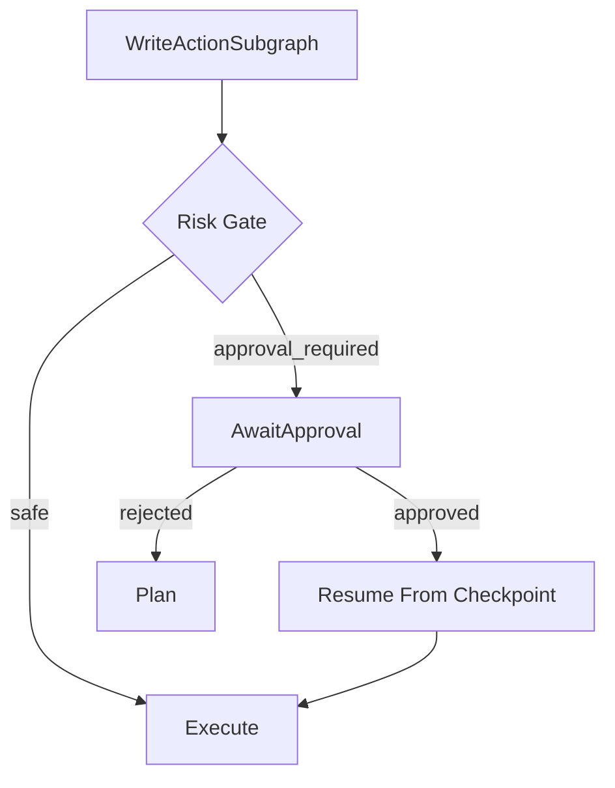

# Итог LangGraph-Adaptation

## Зачем

В проекте реализован не LangGraph как зависимость, а LangGraph-style runtime:

- durable execution через checkpoints;
- explicit state machine и subgraphs;
- approval / interrupt / resume;
- replay safety и idempotency discipline;
- policy registry и runtime journal;
- investigation API и runtime metrics.

Это уже не roadmap, а фактическое описание текущего состояния оркестратора.

## Целевая модель

## Подграфы

- `DiscoverySubgraph`: RAG/discovery и первичный выбор `execution_policy`
- `PlanningSubgraph`: генерация следующего DSL-шага и `active_step_id`
- `WriteActionSubgraph`: write-path, approval gate, operation discipline
- `ReadQuerySubgraph`: read/query-path
- `GenericExecuteSubgraph`: прочие безопасные execution-ветки
- `ValidateSubgraph`: post-execution validation и переход `Plan / Recover / Summarize`
- `RecoverySubgraph`: `resume / replan / abort`
- `SummarizeSubgraph`: финальная проверка и summary

### PlanningSubgraph

### WriteActionSubgraph

### ValidateSubgraph

### RecoverySubgraph

### SummarizeSubgraph

## Runtime State Contract

Минимальный runtime state уже формализован:

- `thread_id`
- `trace_id`
- `current_stage`
- `last_transition`
- `attempt_no`
- `execution_policy`
- `active_subgraph`
- `subgraph_history`
- `decision_log`
- `active_step_id`
- `approval_state`
- `side_effect_log`
- `checkpoint_history`

## Transition Contract

Каждый subgraph возвращает единый `SubgraphResult`:

- `Decision`
- `NextStage`
- `Reason`
- `Policy`
- `StepId`
- `Transition`
- `ExecutorResult`
- `ApprovalPending`

Все `decision / reason / policy` нормализуются через centralized registry. Ad hoc значения в runtime contract больше не считаются допустимыми.

## Durable Execution

В рантайме есть:

- `checkpoint history`
- `checkpoint diff`
- `runtime trace`
- `resume from checkpoint`
- `decision timeline`

## Approval / Interrupt / Resume

Approval semantics формализованы:

- `requested`
- `approved`
- `rejected`

И на каждое решение пишутся:

- `decision_log`
- checkpoint
- state update

## Replay Safety / Idempotency

Есть три replay-класса:

- `safe_replay`
- `resume_only`
- `no_replay`

Источники truth для replay policy:

1. `checkpoint details.replay_safety`
2. `side_effect_log.replay_safety`
3. fallback-анализ `PlannedDSL`

Для write-path действует `operation_id` discipline. `resume from checkpoint` блокируется для `no_replay`.

## Policy Layer

Policy registry покрывает:

- `decision_log kind/value`
- `checkpoint_type`
- `subgraph_history decision`
- `event_history event_type`
- state transition values
- `decision / reason / policy` в `SubgraphResult`

Это значит, что весь runtime journal проходит через один policy layer, а не через разрозненные строки по коду.

## Observability

### Runtime Trace

Нормализованный trace event содержит:

- `timestamp`
- `trace_type`
- `kind`
- `decision`
- `source`
- `step_id`
- `policy`
- `reason`
- `subgraph`
- `stage`
- `transition`
- `attempt`
- `trace_id`
- `thread_id`
- `details`

### Metrics

Серверный metrics API возвращает:

- `approval_requested / approved / rejected / approval_rate`
- `recovery_resume_count / replan_count / abort_count / recovery_success_rate`
- `checkpoint_count`
- `decision_count`
- `top_failure_reasons`
- `execution_path_frequency`
- `transition_frequency`
- `retry_count_per_policy`
- `stage_outcome_metrics`

## Investigation API

Для расследования сбоев добавлены:

- `ПолучитьЦепочкиСбоевОркестратора()`
- `ПочемуОстановилсяОркестратор()`

Они используют unified runtime trace и checkpoint history, а не частные логи.

## Текущее отличие от исходного плана

Исходный `LANGGRAPH_ADOPTION_PLAN.md` больше не нужен как backlog: его ключевые пункты реализованы и перенесены сюда в виде итоговой архитектуры.

## Практический итог

Оркестратор теперь ближе не к "циклу с if-ветками", а к graph-runtime:

- стадии оформлены как subgraphs с единым контрактом;
- side effects отделены от replay semantics;
- recovery и approval формализованы;
- runtime state пригоден для replay, дебага и метрик;
- investigation не зависит от ручного чтения логов.

Это и есть полезная часть LangGraph-подхода, перенесенная в текущую 1С-архитектуру без переписывания оркестратора с нуля.
