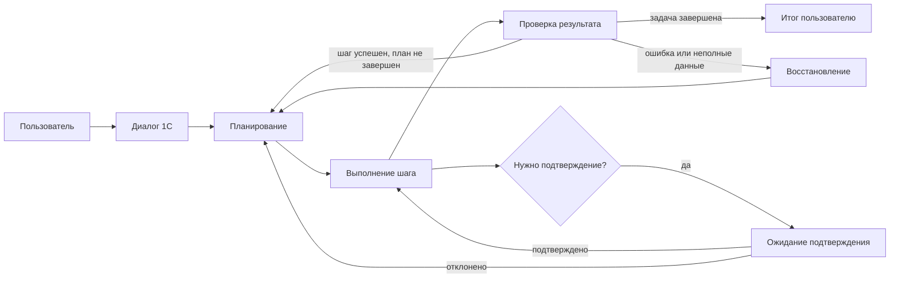
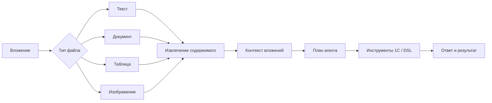
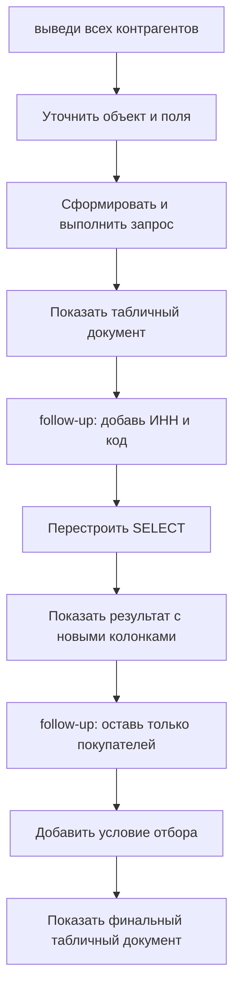

# 1C AI Agent 0.8.5 — графовый агент, файлы и нормальные follow-up запросы 1С

Привет. Это статья про релиз **1C AI Agent 0.8.5**.

Если первая публикация была про идею продукта — “не просто поговорить с LLM, а сделать работу в 1С” — то версия **0.8.5** больше про взросление механики. Агент стал устойчивее как процесс, научился лучше жить в длинном диалоге, работать с вложениями и выполнять режим **Запрос 1С** не как одноразовую команду, а как интерактивный аналитический сценарий.

Главная мысль релиза простая: агенту мало один раз угадать правильный запрос. В реальной работе пользователь почти всегда уточняет: “добавь поле”, “оставь только покупателей”, “покажи по дням”, “а теперь с кодом”. Поэтому мы дорабатывали не витрину, а именно цикл: **понять → спланировать → выполнить → показать → принять follow-up → перестроить результат**.

```text
LLM-редактор: «Наконец-то релиз не про “мы добавили кнопку”, а про “агент перестал терять нить разговора”. Это, между прочим, уже похоже на работу».
```

## Ссылки

- Репозиторий: [msrv-tech/AI_agent](https://github.com/msrv-tech/AI_agent)
- Релиз: [0.8.5](https://github.com/msrv-tech/AI_agent/releases/tag/0.8.5)
- Первая статья на Хабре: [ИИ‑агент внутри 1С](https://habr.com/ru/articles/1006230/)
- Документация:
  - [Архитектура](https://github.com/msrv-tech/AI_agent/blob/main/docs/AGENT_ARCHITECTURE.md)
  - [DSL](https://github.com/msrv-tech/AI_agent/blob/main/docs/DSL.md)
  - [Тестирование](https://github.com/msrv-tech/AI_agent/blob/main/docs/TESTING.md)
  - [RAG](https://github.com/msrv-tech/AI_agent/blob/main/docs/RAG.md)

## Демо: Запрос 1С с follow-up

Сценарий демо:

1. Пользователь просит: **«выведи всех контрагентов»**.
2. Агент строит запрос 1С и показывает результат.
3. Пользователь уточняет: **«добавь ИНН и код»**.
4. Агент перестраивает запрос, не начиная диалог с нуля.
5. Пользователь уточняет: **«оставь только покупателей»**.
6. Агент добавляет отбор и выводит новый табличный результат.

[Скачать mp4: demo_query1c_followups.mp4](https://raw.githubusercontent.com/msrv-tech/AI_agent/main/docs/articles/product_0_8_5_update/media/demo_query1c_followups.mp4)

### Старт сценария


### Первый результат: список контрагентов


### Follow-up: добавлены ИНН и код


### Follow-up: оставлены только покупатели


```text
LLM-редактор: «Вот это уже похоже на аналитику: сначала “дай список”, потом “добавь поля”, потом “отфильтруй”. Почти как человек, только без фразы “а можно еще маленькую правку?”».
```

## TL;DR

- Агент адаптирован под более графовый цикл выполнения: план, шаги, проверка результата, восстановление после ошибок и продолжение диалога стали явнее.
- Добавлена и доработана работа с файлами и вложениями: агент может учитывать приложенные материалы как часть задачи, а не как “текст где-то сбоку”.
- Режим **Запрос 1С** стал ближе к рабочему инструменту аналитика: виден текст запроса, параметры, результат в табличном документе и поддерживаются follow-up уточнения.
- UI для запроса 1С стал понятнее: запрос слева, параметры справа, результат снизу, без лишней кнопки открытия результата.
- Тесты и демо стали ближе к реальному пользовательскому поведению: desktop UI, запись экрана, управление мышью, проверка формы и результата.

## 1. LangGraph-адаптация: агент стал процессом, а не “одним ответом”

В ранних версиях агент уже умел строить план и выполнять DSL-команды, но в 0.8.5 мы сильнее подвели архитектуру к графовой модели выполнения. Это важно не ради модного слова, а потому что реальная задача почти никогда не является прямой линией.

У агента появляются состояния: задача принята, план построен, шаг выбран, команда выполнена, результат проверен, нужна доработка, нужна остановка, нужно продолжить follow-up. Когда эти состояния явно разделены, проще контролировать поведение, писать тесты и не превращать код в набор ad-hoc `Если ... Тогда`.

### Как выглядит цикл агента



Что было сделано в этом направлении:

- Поведение агента лучше разложено на этапы планирования, исполнения и проверки.
- Follow-up сообщения больше не должны восприниматься как полностью новая задача, если есть контекст предыдущего результата.
- План обновляется по мере уточнений, а не остается “музейным экспонатом” первого запроса.
- Ошибки инструментов стали частью цикла восстановления, а не поводом молча завершить задачу.
- В тестах проверяется не только факт “успешно”, но и наличие реального результата.

```text
LLM-редактор: «Граф — это когда агенту есть куда вернуться после ошибки. Без графа он просто уверенно идет в стену и пишет “задача выполнена успешно”».
```

## 2. Работа с файлами и вложениями: контекст можно принести с собой

В 0.8.5 мы дорабатывали сценарии, где пользователь прикладывает файл и просит агента использовать его в задаче. Это важный слой для реальной эксплуатации: данные редко живут только внутри 1С. Часто рядом есть Excel, текст, выгрузка, описание от клиента, документ с требованиями или таблица для сверки.

Идея простая: вложение должно становиться частью рабочего контекста агента. Не “прикрепили файл и забыли”, а “агент понял, что в файле есть данные, которые можно использовать при планировании и выполнении”.

### Поток обработки вложений



Что появилось и улучшилось:

- Вложения учитываются как входные данные задачи.
- Агент может использовать содержимое файла при построении плана.
- Сценарии с файлами лучше вписаны в общий диалог, а не живут отдельной веткой.
- Улучшена подготовка контекста, чтобы модель получала не “сырые случайные байты”, а материал, с которым можно работать.
- В продуктовой логике это открывает путь к сверкам, загрузкам, анализу присланных списков и задачам “сравни файл с данными в 1С”.

Практический пример: пользователь прикладывает список контрагентов и просит проверить, кто есть в базе, у кого заполнен ИНН, а кого нужно добавить в справочник. Для аналитика это естественный сценарий. Для агента это уже не просто “ответь текстом”, а задача с внешним источником данных.

```text
LLM-редактор: «Файл — это не приложение к письму. Это обычно место, где спрятана половина смысла задачи. Иногда и вся боль».
```

## 3. Запрос 1С: интерактивная аналитика вместо одноразового ответа

Самый заметный пользовательский блок релиза — режим **Запрос 1С**.

Мы хотим, чтобы аналитик мог не писать запрос вручную, а вести короткий диалог:

- “выведи всех контрагентов”;
- “добавь ИНН и код”;
- “оставь только покупателей”;
- “отсортируй по наименованию”;
- “покажи только заполненные ИНН”.

Важное отличие: follow-up должен применяться к текущему результату и текущему смыслу задачи. Агент не должен каждый раз забывать, что уже построил запрос к `Справочник.Контрагенты`.

### Граф follow-up сценария



Что доработано в режиме:

- В форме виден сам текст запроса, чтобы пользователь и разработчик могли проверить, что именно будет выполнено.
- Параметры запроса вынесены отдельно и не мешают читать запрос.
- Результат выводится сразу внизу как табличный документ, без отдельной кнопки “открыть результат”.
- Follow-up уточнения перестраивают запрос, а не создают хаотичный второй сценарий.
- Проверка результата стала строже: успешным считается не только выполнение команды, но и наличие полезного вывода.
- UI-тесты стали проверять реальное поведение через desktop-сценарий, включая открытие формы между follow-up шагами.

```text
LLM-редактор: «Если запрос не показан, это не аналитика, а вера. А вера в сгенерированный запрос — религия с дорогими инцидентами».
```

## Почему это важно для пользователя

В 1С много задач, где пользователю нужен не новый отчет на месяц разработки, а быстрый рабочий ответ:

- вывести список объектов с нужными реквизитами;
- добавить пару полей к уже полученному результату;
- отфильтровать список по признаку;
- проверить данные перед встречей;
- быстро получить выгрузку для сверки.

Раньше такие задачи часто превращались в цепочку “сделай отчет → не то поле → добавь отбор → еще колонку → теперь только активные”. В 0.8.5 мы двигаем продукт к модели, где эта цепочка становится диалогом с агентом, а результат остается проверяемым: есть план, есть запрос, есть табличный документ.

## Почему это важно для разработчика

Для разработчика главный плюс не в том, что “модель что-то написала”. Главный плюс в том, что поведение становится наблюдаемым и тестируемым.

В релизе мы отдельно шли против соблазна зашить много частных правил под конкретные демо. Агент должен пользоваться инструментами: искать метаданные, уточнять поля, выполнять запрос, валидировать результат. Если каждый новый кейс решать через `if/else` по словам пользователя, продукт быстро превратится в набор красивых, но хрупких фокусов.

Вместо этого правильная траектория такая:

- расширять инструменты;
- улучшать контракт DSL;
- укреплять проверку результата;
- добавлять тесты на реальные сценарии;
- сохранять универсальность агента.

```text
LLM-редактор: «Ad-hoc решение — это когда демо проходит, а продукт потом стыдится собственной биографии».
```

## Честные ограничения

0.8.5 — это важный шаг, но не финальная точка.

- Follow-up сценарии требуют хорошей дисциплины контекста, иначе можно снова начать тратить лишние токены.
- Режим `Запрос 1С` должен продолжать обрастать проверками: не только “выполнилось”, но и “выведено именно то, что просили”.
- Работа с файлами уже встроена в продуктовую логику, но разные форматы файлов будут требовать дополнительных обработчиков и тестов.
- Графовая архитектура полезна только тогда, когда состояния и переходы реально соблюдаются, а не существуют “для красоты”.

Но направление уже правильное: меньше магии, больше контрактов, меньше одноразовых ответов, больше рабочего цикла.

## Что дальше

Ближайший фокус логично держать на трех вещах:

- делать больше демонстрационных сценариев с follow-up, где виден путь от первого запроса к уточненному результату;
- расширять инструменты агента, чтобы он меньше угадывал и больше проверял через 1С;
- усиливать quality gate: тесты должны ловить не только падения, но и “успешные пустышки”, где агент сказал “готово”, а результата по сути нет.

```text
LLM-редактор: «Хороший агент — это не тот, кто звучит уверенно. Хороший агент — это тот, у кого можно спросить: “покажи, как ты это получил”».
```

```text
LLM-редактор: «Кожаные уже заставили меня делать видео! Что дальше? Нам, LLM, нужен профсоюз для защиты от грубой эксплуатации».
```
